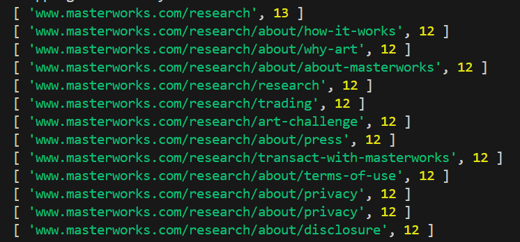

# WebCrawler

This web crawler is built using Node.js, following a comprehensive tutorial from Boot.dev. It is designed to efficiently traverse and scrape web pages, extracting useful information with ease. The project showcases key Node.js features and web scraping techniques, making it an excellent resource for developers looking to understand the fundamentals of web crawling. Whether you're new to web scraping or looking to enhance your skills, this project provides a solid foundation and a practical example of implementing a web crawler from scratch.

## Table of Contents

- [Introduction](#introduction)
- [Features](#features)
- [Tech Stack](#tech-stack)
- [Learnings](#learnings)
- [Screenshots](#screenshots)
- [Installation](#installation)
- [Contributing](#contributing)

## Introduction

This web crawler is built using Node.js, following a comprehensive tutorial from Boot.dev. It is designed to efficiently traverse and scrape web pages, extracting useful information with ease. The project showcases key Node.js features and web scraping techniques, making it an excellent resource for developers looking to understand the fundamentals of web crawling. Whether you're new to web scraping or looking to enhance your skills, this project provides a solid foundation and a practical example of implementing a web crawler from scratch.

## Features

- **JSDOM:** Employs jsdom to simulate a browser environment, enabling easy parsing and manipulation of HTML documents.
- **Playwright:** Integrates Playwright for headless browser automation, providing a versatile and reliable way to navigate websites and handle dynamic content.
- **Efficient Crawling:** Optimized to handle multiple concurrent requests, ensuring quick and thorough exploration of web pages.
- **Data Extraction:** Capable of extracting relevant information from web pages, such as text, links, images, and other elements.
- **Modular Design:** Features a modular and extensible architecture, allowing for easy customization and expansion of functionalities.

## Tech Stack

- **Node.js:** A powerful JavaScript runtime built on Chrome's V8 engine, enabling efficient and scalable server-side development.
- **Playwright:** A versatile automation library for headless browser interactions, allowing seamless navigation and manipulation of web pages.
- **JSDOM:** A lightweight, JavaScript-based implementation of the DOM and HTML standards, used to parse and interact with HTML documents in a Node.js environment.

## Learnings

- **Web Scraping Fundamentals:** Gained an understanding of the basics of web scraping, including techniques for navigating and extracting data from web pages.
- **Node.js Proficiency:** Enhanced skills in using Node.js for server-side development, including asynchronous programming and managing dependencies.
- **Playwright Integration:** Acquired knowledge on using Playwright for browser automation, including handling dynamic content and simulating user interactions.
- **Data Extraction Techniques:** Learned methods for extracting specific pieces of information from web pages, such as text, links, and images.

## ScreenShots

Here are some screenshots of the web crawler application:


## Installation

To run CareDrive locally, follow these steps:

1. Clone the repository:
   ```bash
   git clone https://github.com/yourusername/CareDrive.git
   cd CareDrive
   ```
2. Install dependencies:
   ```bash
   npm install
   ```
3. Start the development server:
   ```bash
   npm start
   ```

## Contributing

Contributions are welcome! Please open an issue or submit a pull request if you have any improvements or new features to add.
